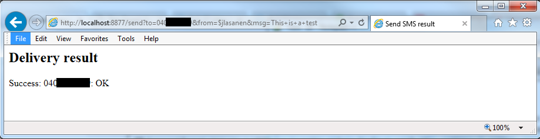

# HTTP adapter

This is an __HTTP adapter__ which implements enough of the _Content Gateway HTTP interface_ to enable sending and receiving SMS messages through [Opaali](https://developer.opaali.telia.fi/about) instead of Content Gateway. 

From the point of view of your existing application, it can more or less be used as a drop-in replacement for the CGW Provider Server. You will need to rethink the security aspect, as there will not, by default, be a secure encrypted tunnel between the http\_adapter and Opaali like there was between the _CGW Provider Server_ and _CGW Operator Server_.

While this software was _intended for making the migration_ from Content Gateway to Opaali easier (_so you don't need to rewrite all of your existing service application_) you can also use it as an easier interface to Opaali (_if you want to avoid learning to use the REST API..._). 

The source code (written in _Java version 8_) is available for you to use, but _there will be __no__ official support for this code by Telia_!

However, as the http\_adapter is (_at the time of writing this_) used in migration of some internal services, there is a good chance that it actually works and bugs may get fixed. In any case: _the source code is here so you can modify and fix it by yourself or have someone fix it for you_. 

For documentation, your best source at the moment is the __http_adapter__ related articles published in the [Opaali Blog](https://miikos.github.io/Opaali/indexall/).

----

And remember: _there will be __no__ official support for this code by Telia_!

## Building

Sorry, there is no build script at the moment. You'll need to manage compiling the source code by yourself.
You will need an external JSON implementation which can be found here: https://github.com/stleary/JSON-java

(You can find pre-built http_adapter releases from the Release page: https://github.com/MiiKos/Opaali/releases )

## Configuring

You will need a configuration file which should be specified as command line parameter when starting the software.
An example configuration file can be found in config directory.

Depending on the platform you run this software on, you may want to set the _cgwCharset_ setting to _ISO-8859-1_ or _UTF-8_ to get correct special characters.

## Running

Here is an example of running the software (this was done on Windows):
```
C:\Users\lasanenj\workspace\SmsServer\bin>java -cp .;..\..\JSON-java-master\bin smsServer.SmsServer ..\config.txt
2017-07-12 17:21:55,536 INFO Default CharSet:windows-1252
2017-07-12 17:21:55,679 INFO processing configuration file "..\config.txt"
2017-07-12 17:21:55,679 INFO comment:# common config parameters are at the beginning
2017-07-12 17:21:55,680 INFO comment:# server port
2017-07-12 17:21:55,680 INFO config :port=8877
2017-07-12 17:21:55,680 INFO comment:# API host name
2017-07-12 17:21:55,681 INFO comment:#API_HOST=api.sonera.fi
2017-07-12 17:21:55,681 INFO config :API_HOST=api.opaali.telia.fi
2017-07-12 17:21:55,682 INFO comment:
2017-07-12 17:21:55,682 INFO comment:# log file name
2017-07-12 17:21:55,682 INFO config :log_file=OpaaliLog.txt
2017-07-12 17:21:55,682 INFO comment:# log level: 0=NONE, 1=ERROR, 2=WARNING, 3=INFO, 4=DEBUG,
2017-07-12 17:21:55,683 INFO config :log_level=2
2017-07-12 17:21:55,683 INFO comment:
2017-07-12 17:21:55,683 INFO comment:# service sections [name:type]
2017-07-12 17:21:55,683 INFO section:[send:cgw]
2017-07-12 17:21:55,684 INFO comment:# character set for CGW API side
2017-07-12 17:21:55,684 INFO config :cgwCharset=ISO-8859-1
2017-07-12 17:21:55,685 INFO config :applicationUserName=b535b0c5e5ae815cea82db6b3b25059a
2017-07-12 17:21:55,686 INFO config :applicationPassword=1%AMvv?w
2017-07-12 17:21:55,687 INFO comment:
2017-07-12 17:21:55,688 INFO comment:
2017-07-12 17:21:55,688 INFO comment:
2017-07-12 17:21:55,689 INFO comment:# end of config"
2017-07-12 17:21:55,690 INFO comment:
2017-07-12 17:21:55,690 INFO end of configuration data reached
2017-07-12 17:21:56,069 INFO CGW HTTP API started
```

## Using

You have probably used Content Gateway before so you should know how to send a message using its HTTP interface.
Here is an example, anyway:


### Mandatory parameters

The parameters _to_, _from_ and _msg_ must always be supplied when sending a message:

```
http://<host>:<port>/send?to=<recipient>&from=<sender>&msg=<message content>
```

### Sending flash messages

You can send _flash text messages_ by adding parameter _mcl=0_:

```
http://<host>:<port>/send?to=<recipient>&from=<sender>&msg=<flash message content>&mcl=0
```

### Sending binary messages

There is also support for sending binary messages by adding parameter _bin_. You should specify the binary message content in hexadecimal, and typically you will also want to add a _User Data Header_ in hexadecimal using parameter _udh_.

```
http://<host>:<port>/send?to=<recipient>&from=<sender>&msg=<binary message content>&udh=<User Data Header>&bin
```

### Testing without actually sending

You can add the parameter _validateonly_ to have the parameters validated _without actually sending a text message_. This can be useful for checking that the built-in _http-server_ is still working.
